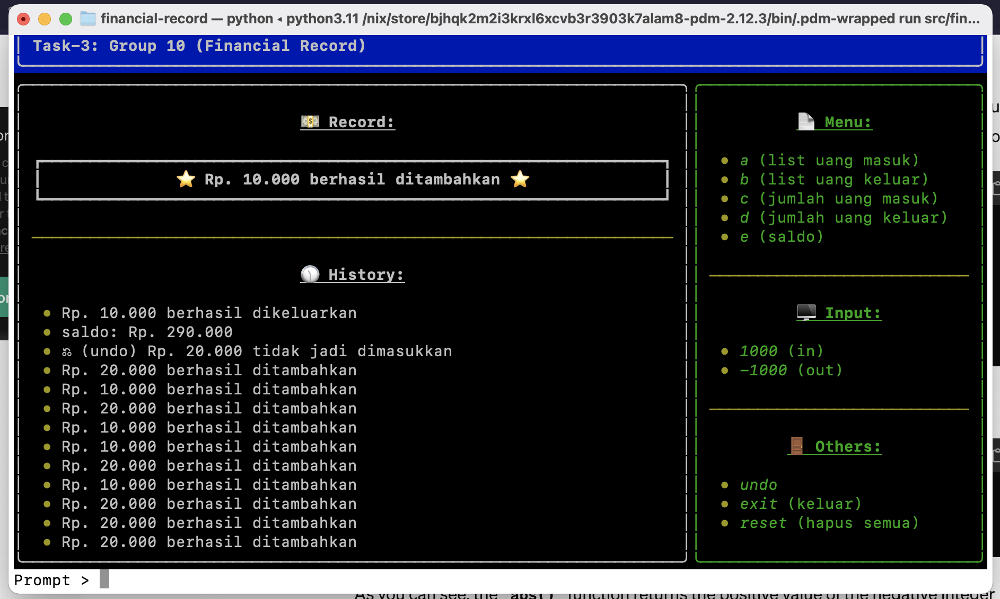

# financial-record


a CLI app written in python to records your money in and out. it's very simple and privacy friendly. once you type `exit` your data will be gone as well. no DB no worries ☠️

## How to Start
```bash
nix-shell
pdm install
pdm run src/financial_record/main.py
```

## How to Use
the guide is available in the right side of application 👌